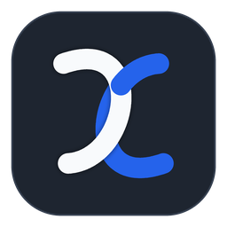

<p align="center">
  <b>ReDisplay</b>
</p>

<p align="center">
  
</p>

<p align="center">
  <b>轻巧易用，一线畅联，基于 NVENC + 有线 ADB 的 Windows 低延迟高刷安卓副屏</b>
</p>

<p align="center">
  
  
  
  
</p>

ReDisplay 是一套开源、全链路硬件加速的超低延迟有线副屏拓展系统。基于高速 USB 3.2 Type-C ，将安卓设备无缝接入 Windows ，作为原生高刷新率副屏。

## ✨ 功能/特性

- **2K 144hz 或更高**
- **硬件编码 3ms**
- **全链路 15ms**
- **参数随心调控**
- **实时状态遥测**
- **智能设备握手**
- **线材实时测速**
- **软件开箱即用**
- **MD3设计风格**
- **自动设备唤醒**
- **自动重连常驻**
- **多设备热插拔**

## 🚀 快速上手

### 1. 准备工作
- **Windows**: Windows 10/11 + NVIDIA 显卡 (支持 NVENC)。
- **安卓设备**: Android 10 +
- **连接线材**: USB 3.2 Gen 2 (或更高)
- **开启调试**: 在安卓端【设置】→【开发者选项】中开启【USB 调试】。

### 2. 启动服务
- 访问 Releases 下载 `ReDisplay-v1.0.0-Win64.zip`，双击运行 `ReDisplay.exe` 即可打开控制中心。

## 📐 低延迟架构


```
[ Windows Desktop ]
         |
         ▼
(Stage 1) Windows DWM  (120Hz+ 动态合成)
         |
         ▼
(Stage 2) Windows.Graphics.Capture 3-Buffer
         |
         ▼
(Stage 3) NVIDIA NVENC 13.1 P1 
         |
         ▼
(Stage 4) Host TCP
         |  (USB 3.2 Gen 2 (+) ) Cable
         ▼
(Stage 5) Android ADB Tunnel TCP
         |
         ▼
(Stage 6) Qualcomm Snapdragon MediaCodec
         |
         ▼
(Stage 7) SurfaceFlinger
```

## 🔧 多层级优化

- **Windows.Graphics.Capture 3-Buffer Drop-to-Latest Pipeline**
- **NVENC Texture Registration Cache**
- **Qualcomm Codec 2.0**
- **高精度时钟调度**